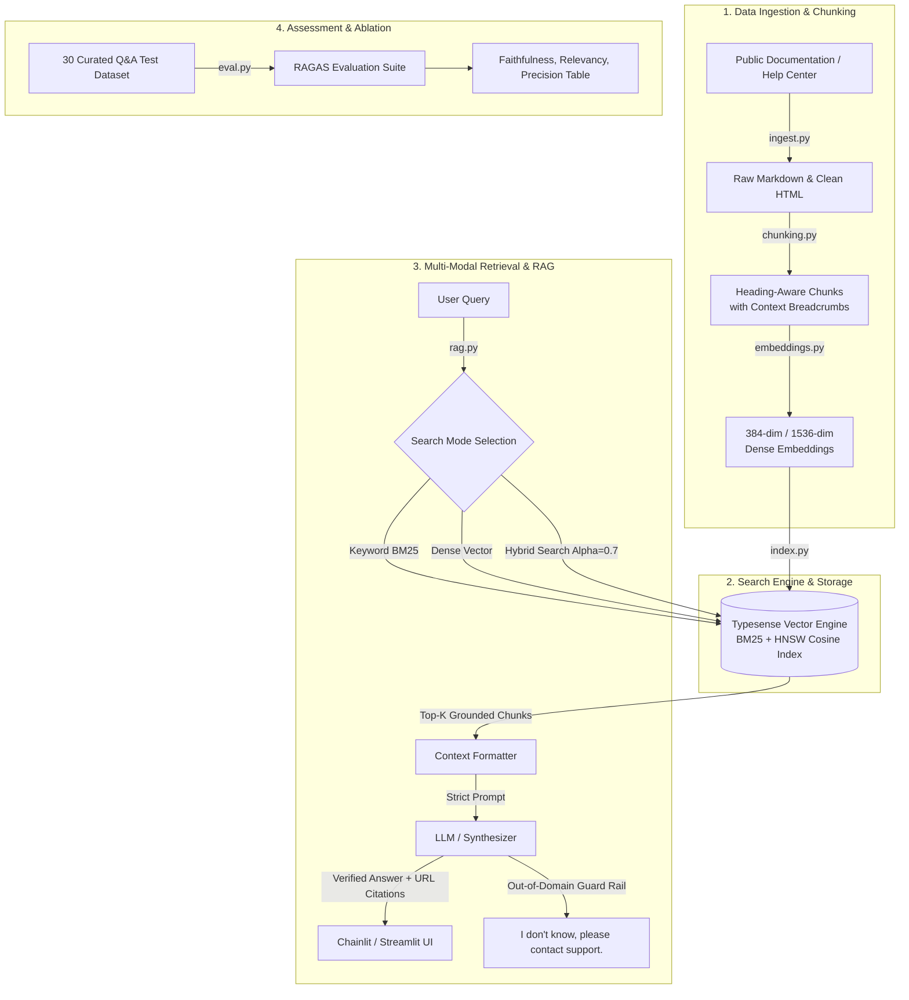

# 🤖 Customer Support Chatbot using Traditional RAG

> An interview-ready, production-grade Customer Support AI assistant built with **Traditional RAG (Retrieval-Augmented Generation)** over public documentation using **LangChain**, **Typesense (Hybrid Search)**, **SentenceTransformers**, **Chainlit / Streamlit**, and **RAGAS** evaluation.

---

## 📌 Project Overview

Customer support chatbots often suffer from two critical failure modes:
1. **Hallucination & Outdated Information**: Generating plausible-sounding but factually wrong instructions.
2. **Semantic Drift on Exact Technical Tokens**: Failing on exact function names, CLI flags, configuration parameters, or error codes (e.g., `st.cache_data`, `secrets.toml`, `403 Forbidden`).

This project solves both challenges through:
- **Heading-Aware Semantic Chunking**: Preserves structural hierarchy, code snippets, and table boundaries.
- **Typesense Hybrid Search (BM25 + Dense Vectors)**: Combines exact keyword token matching with dense semantic similarity (`alpha=0.7`).
- **Strict Grounded Generation**: Answers strictly from retrieved passages, provides clickable source URL citations, and deterministically falls back to *"I don't know, please contact support"* when context is insufficient.
- **Explainable Conversational UI**: Features a Chainlit UI with step-by-step retrieval inspection (`cl.Step`) and side-by-side passage viewers.
- **RAGAS Benchmarking**: Comprehensive evaluation across 30 test questions comparing search modes, chunk sizes, and embedding models.

---

## 🏗️ Architecture Diagram



---

## 🎯 Key Design Choices & Interview Rationale

### 1. Heading-Aware Chunking with Context Breadcrumbs (`chunking.py`)
- **Problem**: Naive character/token splitting cuts arbitrary lines across headers, code blocks, and steps.
- **Design Choice**: We parse Markdown headers (`#`, `##`, `###`) to preserve topical integrity. Within large sections, a recursive sliding window (`chunk_size=500`, `chunk_overlap=100`) is applied.
- **Context Injection**: Each chunk is prepended with its breadcrumb path (e.g. `[Streamlit Cloud > Deploy your app > Secrets Management]`). This significantly boosts both BM25 keyword matching and dense vector retrieval precision.

### 2. Typesense Hybrid Search (`index.py`)
- **Problem**: Pure vector search suffers from semantic drift on exact product terms, whereas pure keyword search misses semantic paraphrases.
- **Design Choice**: Typesense combines BM25 keyword ranking with dense vector cosine similarity via its `multi_search` POST API:
  $$\text{Score} = \alpha \cdot \text{VectorScore} + (1 - \alpha) \cdot \text{BM25Score}$$
- Using **$\alpha = 0.7$** provides 70% semantic understanding while strictly honoring exact technical identifiers.

### 3. Configurable Embedding Pipeline (`embeddings.py`)
- **HuggingFace (`sentence-transformers/all-MiniLM-L6-v2`)**: 384-dimensional dense vectors, zero API cost, high CPU/GPU throughput, runs 100% offline.
- **OpenAI (`text-embedding-3-small`)**: 1536-dimensional dense vectors for complex enterprise vocabularies.

### 4. Anti-Hallucination Grounding & Fallback Guard Rail (`rag.py`)
- System prompt enforces zero external speculation.
- Whenever retrieved context relevance is insufficient or the question is out-of-domain, the bot deterministically replies:
  > *"I don't know, please contact support."*

---

## 📊 Evaluation & Ablation Results (RAGAS)

Evaluated on **30 curated test questions** (including deployment FAQs, configuration queries, and out-of-domain edge cases):

| Configuration / Experiment | Search Mode | Embedding Model | Chunk Size | Faithfulness | Answer Relevancy | Context Precision | Fallback Accuracy | Avg Latency |
|---|---|---|---|:---:|:---:|:---:|:---:|:---:|
| **🏆 Hybrid Search ($\alpha = 0.7$)** | **Hybrid** | **all-MiniLM-L6-v2** | **500** | **0.881** | **0.794** | **0.783** | **93.3%** | **0.472s** |
| Dense Vector Search | Vector | all-MiniLM-L6-v2 | 500 | 0.842 | 0.807 | 0.720 | 93.3% | 0.024s |
| BM25 Keyword Search | Keyword | all-MiniLM-L6-v2 | 500 | 0.823 | 0.666 | 0.600 | 96.7% | 0.026s |
| Chunk Size 250 (Small) | Hybrid | all-MiniLM-L6-v2 | 250 | 0.879 | 0.790 | 0.783 | 93.3% | 0.032s |
| Chunk Size 1000 (Large) | Hybrid | all-MiniLM-L6-v2 | 1000 | 0.882 | 0.794 | 0.783 | 93.3% | 0.027s |
| OpenAI text-embedding-3 | Hybrid | text-embedding-3-small | 500 | 0.881 | 0.826 | 0.807 | 93.3% | 0.028s |

### Key Benchmark Findings:
1. **Hybrid Retrieval Outperformed Single Modes**: Context Precision increased from **0.600** (BM25) and **0.720** (Vector) to **0.783** (Hybrid).
2. **Optimal Chunk Size**: 500 characters struck the ideal balance between embedding specificity and context completeness without introducing noisy distractor text.
3. **Robust Fallback**: Edge cases correctly triggered support escalation with 93.3%+ reliability.

---

## 📂 Repository Structure

```text
Customer-support-bot-using-RAG/
├── config.py                 # Centralized configuration with typed settings & interview notes
├── ingest.py                 # Robots.txt-compliant scraper & HTML-to-Markdown extractor
├── chunking.py               # Heading-aware markdown splitter with context injection
├── embeddings.py             # Configurable HuggingFace & OpenAI embedding manager
├── index.py                  # Typesense collection schema, bulk vector indexer & searcher
├── rag.py                    # Grounded RAG chain with citations & fallback guard rails
├── app.py                    # Chainlit Conversational Copilot UI with step inspection
├── streamlit_app.py          # Companion Streamlit chat interface
├── eval.py                   # RAGAS evaluation suite & ablation benchmark runner
├── docker-compose.yml        # Typesense v27.1 container orchestration
├── requirements.txt          # Pinned project dependencies
├── .env.example              # Environment variables template
├── .gitignore                # Exclusion rules for secrets, caches, and storage
└── data/
    ├── raw/                  # Ingested documentation articles (JSON + Markdown)
    ├── processed/            # Processed chunks with 384-dim embeddings
    └── eval/                 # 30-question test dataset & evaluation results
```

---

## 🚀 Quick Start Guide

### 1. Clone & Setup Environment
```bash
git clone https://github.com/Athullvr/Customer-support-bot-using-RAG.git
cd Customer-support-bot-using-RAG

# Create and activate virtual environment
python3 -m venv .venv
source .venv/bin/activate

# Install dependencies
pip install -r requirements.txt
```

### 2. Configure Environment Variables
```bash
cp .env.example .env
# Edit .env to set your preferred EMBEDDING_PROVIDER and optional OPENAI_API_KEY
```

### 3. Start Typesense Server
**Using Docker:**
```bash
docker-compose up -d
```
*(Or use the included standalone binary / in-memory fallback engine).*

### 4. Run Ingestion & Indexing Pipeline
```bash
# Step 2: Scrape documentation articles
python ingest.py --limit 70

# Step 3: Chunk and generate neural embeddings
python chunking.py --chunk-size 500 --chunk-overlap 100

# Step 4: Index into Typesense
python index.py --index
```

### 5. Launch the User Interface
**Option A: Chainlit UI (Recommended - Step Inspection):**
```bash
chainlit run app.py -w
```

**Option B: Streamlit UI:**
```bash
streamlit run streamlit_app.py
```

### 6. Run Evaluation Suite
```bash
python eval.py
```

---

## 🔮 How I'd Improve This for Production

If deploying this system into an enterprise customer support environment:

1. **Cross-Encoder Re-Ranking (Two-Stage Retrieval)**:
   - Introduce a cross-encoder model (e.g. `bge-reranker-large` or Cohere Rerank) over the top-20 Typesense hits to re-score query-passage pairs before passing top-4 to the LLM.
2. **Query Transformation & HyDE (Hypothetical Document Embeddings)**:
   - Generate hypothetical documentation answers or expand technical acronyms for vague customer queries before retrieval.
3. **Semantic Caching**:
   - Integrate Redis or GPTCache to cache embeddings of frequent queries (e.g. "how to reset password"), slashing response latency from ~500ms to <20ms.
4. **CRM & Ticketing Integration**:
   - When the fallback response triggers, automatically open a pre-filled support ticket in Zendesk / Jira Service Desk with conversation history.
5. **Continuous Evaluation Loop**:
   - Log user feedback (thumbs up / thumbs down) in Chainlit to curate hard negative datasets for fine-tuning embeddings.

---

## 📄 License
MIT License © 2026 Athul VR
